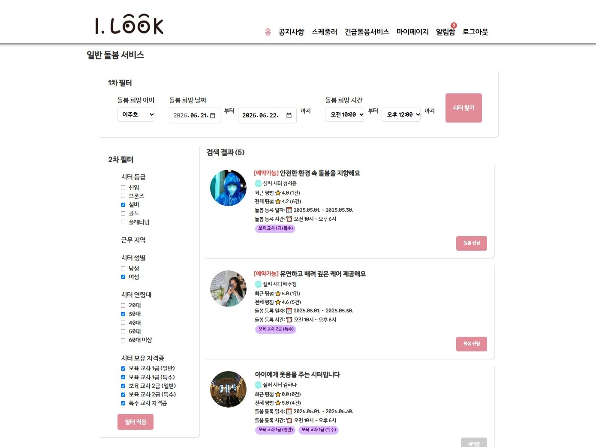
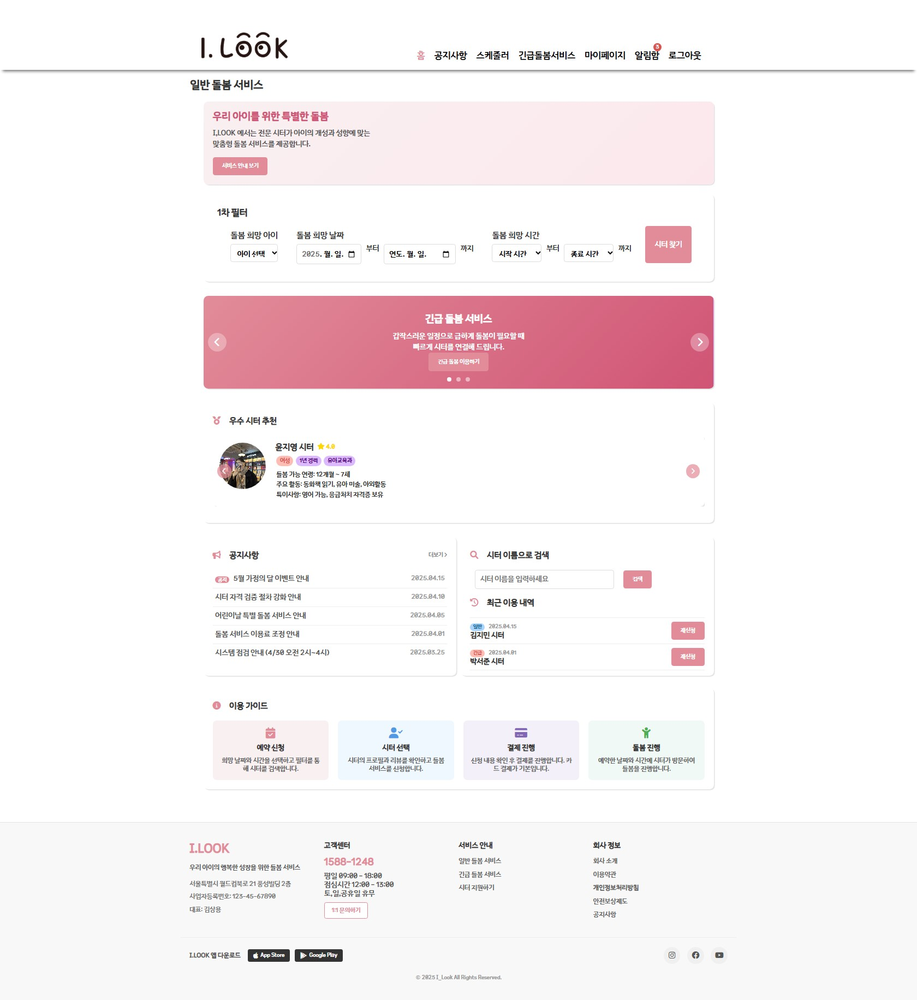
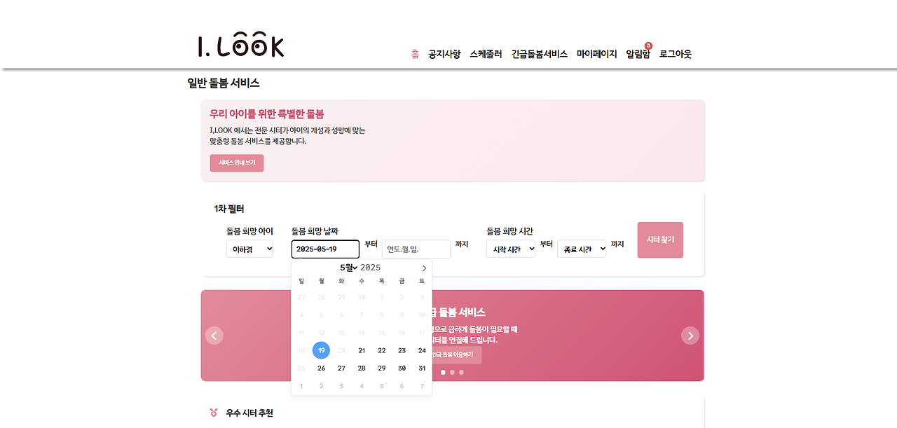
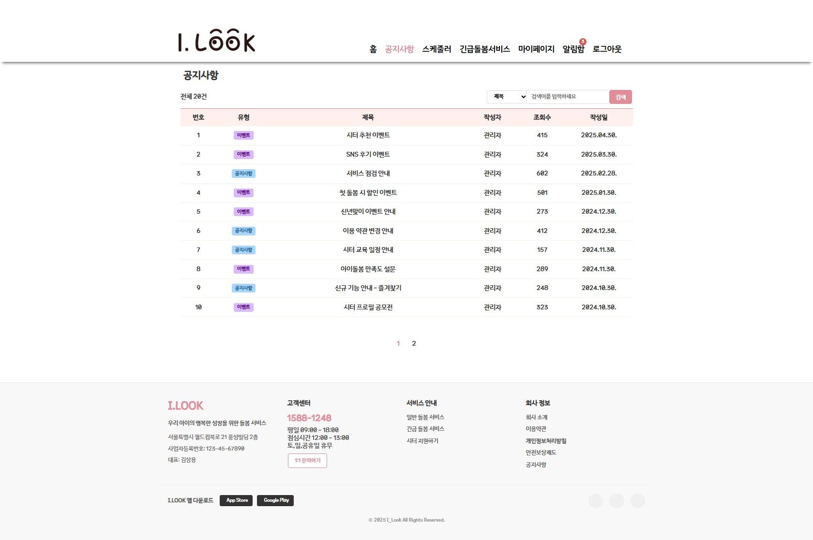

# 👶🏻 I_Look



## 🎯 프로젝트 소개

- 시터 회원에게는 경력 단절 없는 돌봄 일자리를 제공하고,
- 부모 회원에게는 신뢰할 수 있는 돌봄 서비스 예약을 제공하는 웹 애플리케이션
- 개발 기간: 2025.03.20. ~ 2025.04.25. (5 Weeks)
- 개발 인원: 4명

## 📚 사용 기술

- **Frontend**: JavaScript, HTML, CSS, jQuery, AJAX
- **Backend**: Java, JSP, Spring, MyBatis, Oracle
- **Tools & Collaboration**: Git, GitHub, Notion, Miro, Eclipse

## ✨ 주요 기능

- 회원가입 및 로그인, 마이페이지 기능
- 공지사항 게시판 기능
- (시터 회원) 돌봄 서비스 등록 및 예약 승인/거절
- (부모 회원) 돌봄 서비스 검색 및 예약 신청, 리뷰 작성
- (관리자) 회원가입 신청 승인, 돌봄 서비스 통계 대쉬보드 기능

## 👩🏻‍💻 본인 구현 기능

- 사용자 유형에 따른 메인 페이지 출력 기능
  </br>
- 돌봄 서비스 신청 가능한 날짜 및 시간 제한 기능
  </br>
- 조건을 반영한 돌봄 서비스 리스트 검색 및 예약 신청 기능
  </br>
- 공지사항 게시판 주요 기능 (CRUD)
  </br>

## 📁 파일 구조

```
I_LOOK
 ├ WebContent/
 │  ├ META-INF/
 │  ├ WEB-INF/
 │  │  ├ lib/
 │  │  ├ view/
 │  │  ├   ├ genMain.jsp // 부모 회원 돌봄 메인 (1차 필터 설정)
 │  │  ├   ├ genSearchResult.jsp // 돌봄 검색 결과 (2차 필터 설정)
 │  │  ├   ├ genRegListFragment.jsp // 돌봄 검색 결과 (조각파일)
 │  │  ├   ├ genRegDetail.jsp // 돌봄 검색 결과 건별 상세
 │  │  ├   ├ genReqInsertForm.jsp // 돌봄 신청폼
 │  │  ├   ├ genPayResult.jsp // 돌봄 결제 완료
 │  │  ├  └ ...
 │  │  ├ dispatcher-servlet.xml
 │  │  └ web.xml
 │  ├ css/
 │  ├ images/
 │  ├ js/
 │  ├ ...
 │  └ iLook.action
 ├ src/com/team1/
 │  ├ controller/
 │  │  ├ GenReqController.java // 돌봄 관련 로직 Controller
 │  │  └ ...
 │  ├ dto/
 │  ├ mybatis/
 │  └ util/
 ├ ...
 ├ pom.xml
 └ README.md
```

## 🚀 실행 화면

### Screenshots (PDF)

배포가 이루어지지 않은 프로젝트로, 아래 링크에서 PDF 형태로 스크린샷 확인 가능

[https://drive.google.com/file/d/1MMiu4MYvqRgszi8RxjMy4riONEIUUx7n/view?usp=sharing](https://drive.google.com/file/d/1MMiu4MYvqRgszi8RxjMy4riONEIUUx7n/view?usp=sharing)
